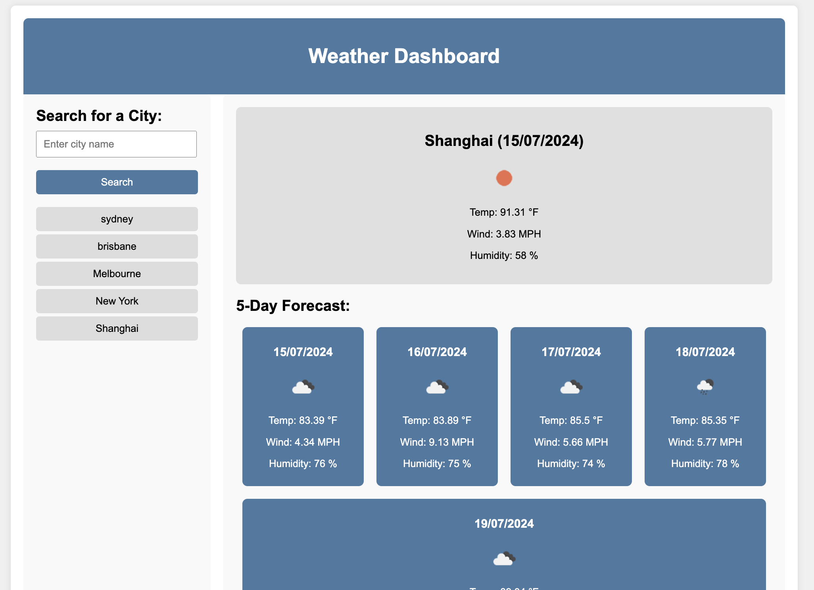

# 03 JavaScript: Employee Payroll Tracker
- The goal of the project is to build a use server side API to build a weather dashboard. It should enable use to retrive weather forcaste by searching specific city. This is the 6th module challenge for the bootcamp student to demonstrate server side API knowledge.
- This page contains HTML, CSS & JS codes
- Live page: 
- Screenshot: 

## General Information
The given task from Bootcamp: 

Third-party APIs allow developers to access their data and functionality by making requests with specific parameters to a URL. Developers are often tasked with retrieving data from another application's API and using it in the context of their own. Your challenge is to build a weather dashboard that will run in the browser and feature dynamically updated HTML and CSS.
Use the 5 Day Weather Forecast to retrieve weather data for cities. The base URL should look like the following: https://api.openweathermap.org/data/2.5/forecast?lat={lat}&lon={lon}&appid={API key}. After registering for a new API key, you may need to wait up to 2 hours for that API key to activate. 

Hint: Using the 5 Day Weather Forecast API, you'll notice that you will need to pass in coordinates instead of just a city name. Using the OpenWeatherMap APIs, how could we retrieve geographical coordinates given a city name?  

You will use localStorage to store any persistent data. For more information on how to work with the OpenWeather API, refer to the Full-Stack Blog on how to use API keys.

**User Story**

AS A traveler   
- I WANT to see the weather outlook for multiple cities
- SO THAT I can plan a trip accordingly

**Acceptance Criteria**
- GIVEN a weather dashboard with form inputs
- WHEN I search for a city
- THEN I am presented with current and future conditions for that city and that city is added to the search history
- WHEN I view current weather conditions for that city
- THEN I am presented with the city name, the date, an icon representation of weather conditions, the temperature, the humidity, and the wind speed
- WHEN I view future weather conditions for that city
- THEN I am presented with a 5-day forecast that displays the date, an icon representation of weather conditions, the temperature, the wind speed, and the humidity
- WHEN I click on a city in the search history
- THEN I am again presented with current and future conditions for that city

## Project Status
Project is completed

## Contact
Created by Wendy Xiao (github: https://github.com/Wendyydxiao) - feel free to contact me!

